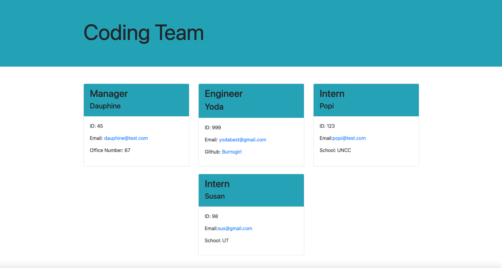

# Team-Profile-Generator

https://github.com/burnsgirl/Team-Profile-Generator
https://burnsgirl.github.io/Team-Profile-Generator/
https://drive.google.com/file/d/1uvoIl246_DwQR2MdYAPznwW-m6E8eZmb/view?usp=sharing

Technologies used: HTML, JavaScript, Bootstrap, Node, Inquirer

For this project I used inquirer to dynamically generate a HTML file with the information inputed on the command line with node. When node index.js is run, it prompts the user to input information about three different types of employess; manager, engineer, intern. Once the user is finished adding employees, then the HTML file is rendered and can be opened in the browser where it is showcased with bootstrap styling. When the email link is clicked, it will open up your default emailing service on your device to send an email. When the GitHub username is clicked, it will take you to that persons GitHub page. All the test come back as passed.

License: MIT

Contact: DAUPHINEBURNS@GMAIL.COM